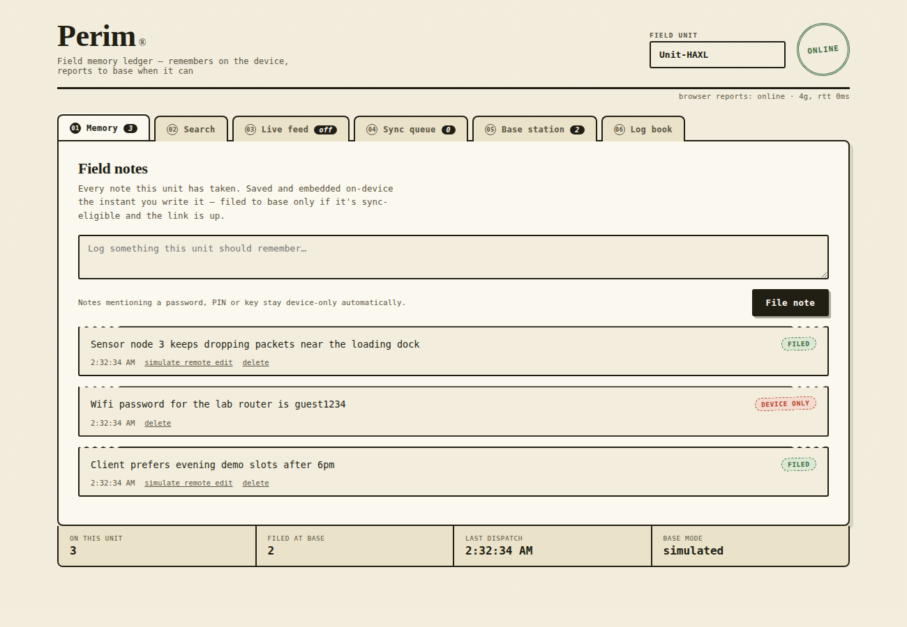
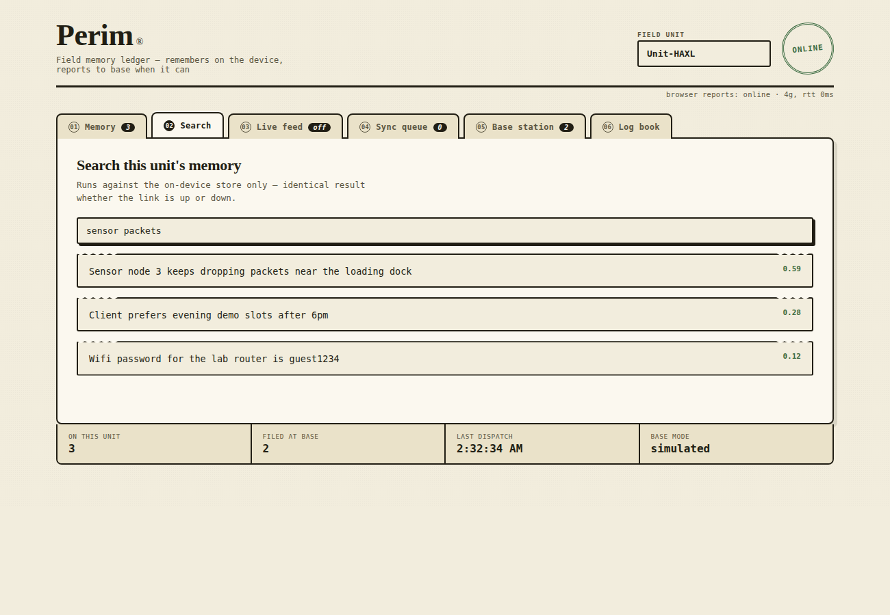
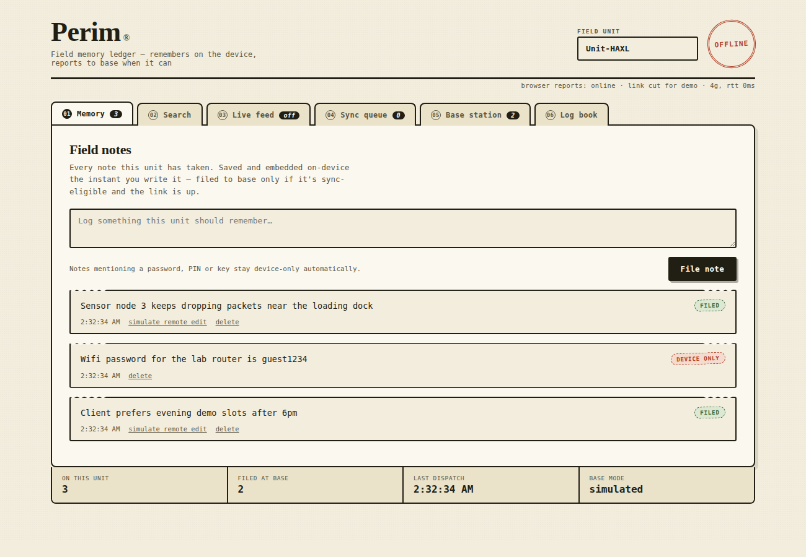
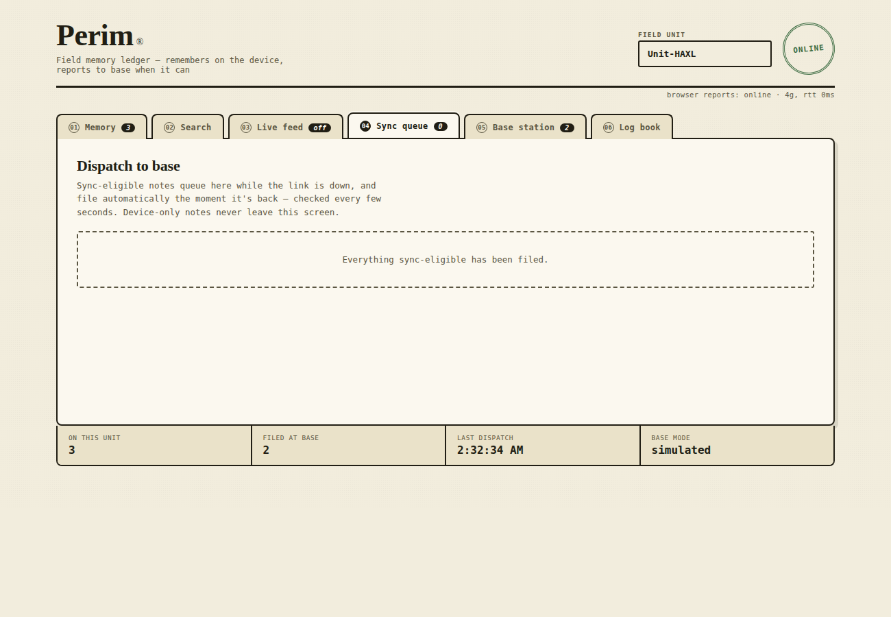
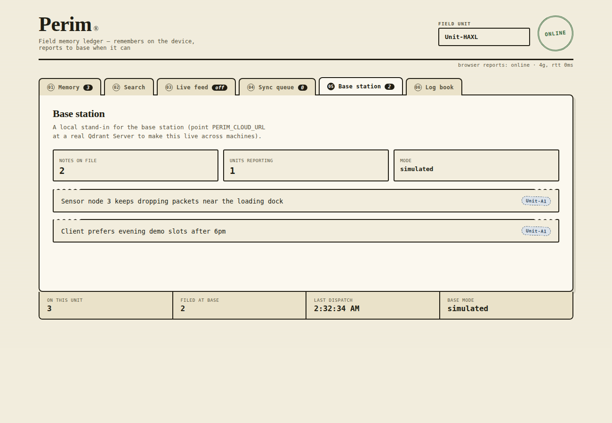
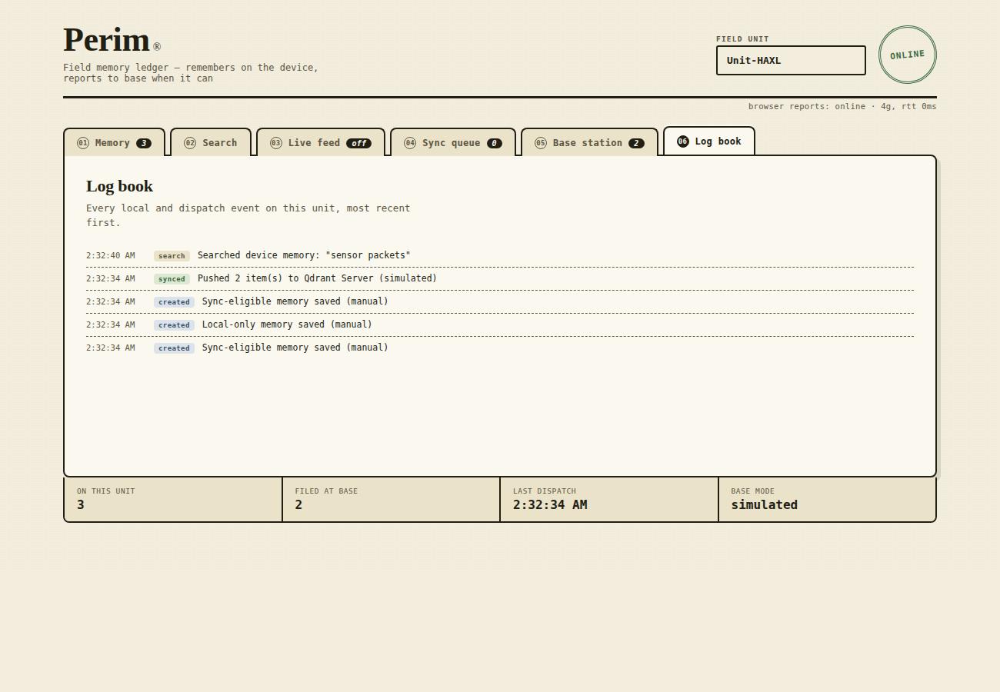

# Perim — Offline-First Edge Memory & Intelligence Platform

A real full-stack app for **Problem Statement 03: AI-Powered Edge Memory &
Intelligence Platform** (Geek Room x Qdrant Hackathon).

- **Backend:** FastAPI + a genuine embedded Qdrant vector store (via
  `qdrant-client`'s local mode — no separate Qdrant server process needed;
  this *is* "Qdrant Edge" running on-device).
- **Frontend:** a hand-built "field ledger" UI (no template, no component
  library) that talks to the backend over real HTTP — nothing is faked with
  `localStorage`.

## What it actually does

- Every note is embedded and stored **on-device** in a real Qdrant
  collection (`edge_memory`) and searched with real cosine similarity —
  works with the network fully disabled.
- A rule engine classifies each note **device-only** or **sync-eligible**
  the moment it's written (sensitive terms — password, PIN, key, etc. —
  stay local automatically).
- A background sync loop pushes sync-eligible notes to a second collection
  (`cloud_memory`, standing in for **Qdrant Server**) the moment the link is
  reachable, and reconciles already-synced notes against the cloud copy on
  every pass.
- Real conflicts (the same note diverging on-device and at base) are
  surfaced for the user to resolve — keep device, keep cloud, or keep the
  most recent — never silently overwritten.
- A live feed captures real browser signals (battery, network type/RTT,
  geolocation) straight into memory, going through the exact same
  classify → queue → sync pipeline as a typed note.

## Screenshots

All taken directly from the running app (`localhost:8420`) — not mockups.

**Field notes** — notes are classified device-only vs sync-eligible the instant they're saved:



**Search** — real cosine-similarity search over the local vector store:



**Offline** — tapping the stamp cuts the link; the unit keeps working and the badge flips to OFFLINE:



**Sync queue** — sync-eligible notes waiting to dispatch to the base station:



**Base station** — the cloud-side view, showing which unit filed each note:



**Log book** — every local and dispatch event, most recent first:



## Run it

```bash
cd backend
pip install -r requirements.txt
uvicorn main:app --reload --port 8420
```

Open **http://localhost:8420**. That's it — the frontend is served by the
same FastAPI app.

### Simulating offline / online

Click the round stamp in the top right to cut the link for a demo, or
actually turn off your machine's networking — either way the app keeps
working, queues sync-eligible notes, and files them the moment the link
is back (checked automatically every few seconds, no page reload needed).

### Simulating a real edge ↔ cloud deployment

By default the "cloud" is a second local Qdrant collection on the same
machine, clearly labelled `simulated` in the UI, so the whole thing runs
with zero setup. To point it at a **real** Qdrant Server instead:

```bash
export PERIM_CLOUD_URL="https://<your-qdrant-instance>:6333"
uvicorn main:app --port 8420
```

Nothing else changes — `store.py` swaps to the real client automatically
and the UI's "Base station" tab reports `remote` instead of `simulated`.

## Project layout

```
backend/
  main.py       FastAPI routes (REST API under /api/*)
  store.py      Qdrant setup, embedding, sync-policy rules, conflict logic, activity log (SQLite)
  requirements.txt
frontend/
  index.html    markup
  style.css     the "field ledger" design system
  app.js        talks to the backend via fetch(); real navigator.onLine /
                navigator.connection / battery / geolocation for the live feed
data/           created at runtime — the embedded Qdrant storage + SQLite log
                (safe to delete to reset the demo)
```

## API reference

| Method | Path                              | What it does                                   |
|--------|-----------------------------------|-------------------------------------------------|
| GET    | `/api/status`                     | counts + cloud mode/reachability                |
| POST   | `/api/memory`                     | create a note `{text, device_id, source}`       |
| GET    | `/api/memory`                     | list this device's notes                        |
| DELETE | `/api/memory/{id}`                | delete a note                                   |
| GET    | `/api/search?q=`                  | semantic search over local memory               |
| POST   | `/api/sync`                       | push pending notes + reconcile synced ones       |
| POST   | `/api/memory/{id}/resolve`        | `{keep: "device"\|"cloud"\|"newest"}`           |
| GET    | `/api/cloud`                      | snapshot of the base-station collection          |
| GET    | `/api/activity`                   | activity log                                     |

## Known limits (and how to close them)

- **Embedding:** uses a fast, dependency-free hashed-n-gram vector so the
  whole thing runs with zero downloads. Swap `embed()` in `store.py` for a
  real sentence-embedding model (e.g. `fastembed`) for stronger semantic
  search — nothing else depends on how the vector is produced.
- **Single edge node per process:** this demo runs one backend = one edge
  device. For a true multi-device demo, run a second copy of `backend/` on
  another port/machine with the same `PERIM_CLOUD_URL` — both will sync
  into the same base station.
